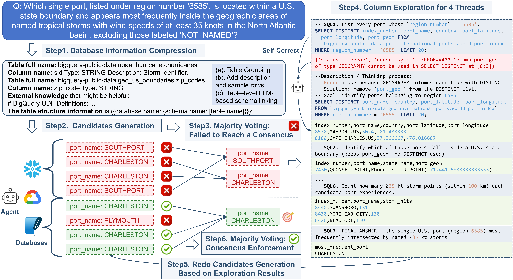

# ReFoRCE: Korean Language Text-to-SQL Agent - Self-**Re**finement, Consensus En**For**cement and **C**olumn **E**xploration

## Overview🔍


본 프로젝트는 [Spider 2.0 리더보드](https://spider2-sql.github.io/)에서 1위를 차지한 ReFoRCE Text-to-SQL 에이전트를 **한국어 환경에서 작동할 수 있도록 수정한 버전**입니다. 

기존 ReFoRCE는 복잡한 실제 Text-to-SQL 시나리오를 반영하는 최고난이도 벤치마크인 Spider 2.0에서 최고 성능을 달성했습니다. 이 한국어 버전은 다음과 같은 원본의 핵심 기능들을 유지하면서 한국어 프롬프트 처리가 가능합니다:

- **(a) Database Information Compression**: Pattern-Based Table Grouping & LLM-Guided Schema Linking을 통한 Long-context 문제 완화
- **(b) Self-refinement**: 다양한 SQL dialect에서 구문 및 의미 오류를 반복적으로 자체 교정
- **(c) Majority-vote consensus**:  후보 SQL 중, 다수결 및 LLM을 통해 최종 SQL을 결정
- **(d) Column Exploration**: 실행 피드백을 통해 연기된 케이스들을 해결

**한국어 수정 사항:**
- 한국어 자연어 질의 처리 지원
- 한국어 프롬프트 템플릿 적용
- 한국어 에러 메시지 및 피드백 처리

## 프로젝트 아키텍처 🏗️
*한국어 ReFoRCE 프로젝트의 전체 구조와 데이터 플로우를 보여주는 다이어그램 링크입니다.*
- [Project Architecture](https://drive.google.com/file/d/1D_mVur0sSS6mng6oRqmZrLmLUUGh_Vqn/view?usp=sharing)

## 빠른 시작 🏁

### 폴더 구조 📁 
```
- 📁 data/                                  -- OmniSQL SQLite 파일 및 스키마 링킹 결과
- 📁 methods/  
  - 📁 ReFoRCE/                             -- 메인 메소드  
    - 📁 examples_fnf/                      -- 실행 중 결과물 (인스턴스별 DB metadata, credential, documents, prompt)  
    - 📁 output/                            -- 실행 결과 (log, csv, sql)  
    - 📁 scripts/                           -- 실행 스크립트  
    - 📄 .env                               -- OpenAI API Key
    - 📄 agent.py                           -- 메인 알고리즘
    - 📄 chat.py                            -- GPT API 클래스 
    - 📄 eval.py                            -- Pass@k 평가   
    - 📄 get_metadata.py                    -- 결과에서 SQL 및 CSV 추출  
    - 📄 prompt.py                          -- 프롬프트 (한국어 지원)  
    - 📄 reconstruct_data.py                -- 데이터 전처리  
    - 📄 requirements.txt                   -- 의존성 패키지  
    - 📄 run.py                             -- 메인 함수
    - 📄 schema_linking.py                  -- 테이블 레벨 스키마 링킹
    - 📄 spider_agent_setup_lite.py         -- Lite DB 설정  
    - 📄 snowflake_credential.json          -- Snowflake credentail  
    - 📄 spider_agent_setup_*.py            -- task(*)별 초기 설정  
    - 📄 sql.py                             -- SQL 실행 클래스  
    - 📄 test_snowflake_connection.py       -- Snowflake credential test  
    - 📄 utils.py                           -- 유틸리티 함수
    - 📄 README.md                          -- 단계별 실행 가이드  
- 📁 venv/                                  -- Python 가상환경
```


### Setup ⚙️  

#### 1. 가상환경 설정 및 의존성 설치

프로젝트 루트 디렉토리로 이동:
```bash
# 현재 위치에서 프로젝트 루트로 이동 (경로는 환경에 맞게 조정)
cd ./
```

가상환경 활성화:
```bash
source venv/Scripts/activate
```

ReFoRCE 메소드 폴더로 이동:
```bash
cd ReFoRCE/methods/ReFoRCE
```

#### 2. 환경 변수 설정

`.env` 파일에 필요한 API 키 및 설정을 추가하세요:
```bash
# OpenAI API 설정
OPENAI_API_KEY=your_openai_api_key_here

# 또는 Azure OpenAI 설정
AZURE_ENDPOINT=your_azure_endpoint_here
AZURE_OPENAI_KEY=your_azure_api_key_here

# 기타 설정
# ...
```

#### 3. 인증 정보 설정

`methods/ReFoRCE` 폴더에 다음 파일들을 배치하세요:
- `snowflake_credential.json`

### 실행 방법 🚀

#### 한국어 버전 메인 실행

**기본 실행 명령어:**
```bash
# 프로젝트 루트 디렉토리로 이동 (현재 위치에 맞게 조정)
cd ./

# 가상환경 활성화
source venv/Scripts/activate

# ReFoRCE 메소드 디렉토리로 이동
cd ReFoRCE/methods/ReFoRCE

# .env 파일 내용을 환경변수로 로드
export $(grep -v '^#' .env | xargs)

# 스크립트 실행 (fnf 태스크, o3 모델 사용)
scripts/run_main.sh --task fnf --model o3
```

이 스크립트들은 다음 단계들의 결과를 보여줍니다:
1. 자체 개선 + 다수결 투표
2. 자체 개선 + 다수결 투표 + 컬럼 탐색 + 재실행
3. 동점시 랜덤 투표
4. 최종 선택 랜덤 투표

#### Pass@k 평가 실행
```bash
bash scripts/run_eval.sh --task {lite, snow, fnf} --log_folder {YOUR_LOG_FOLDER}
```

`--update` 옵션은 골드 SQL을 실행하여 결과를 업데이트할지 여부를 나타냅니다.

#### 부가 실험 (Ablations)

- **컬럼 탐색만 실행:**
```bash
bash scripts/ablation/run_CE.sh --azure --task {lite, snow, fnf} --model o3
```

- **컬럼 탐색 없이 실행:**
```bash
bash scripts/ablation/run_no_col.sh --azure --task {lite, snow, fnf} --model o3
```

- **데이터베이스 정보 압축 없이 실행:**
```bash
bash scripts/ablation/run_no_compression.sh --azure --task {lite, snow, fnf} --model o3
```

- **OmniSQL 형식 실행 (OpenSearchSQL 스키마 링킹 있음/없음):**
```bash
bash scripts/ablation/run_omnisql_format_no_col.sh o3
bash scripts/ablation/run_omnisql_format_CE.sh o3
```

- **골드 테이블로 실행:**
[Spider2 Repo](https://github.com/xlang-ai/Spider2)에서 골드 테이블을 가져와 `scripts/ablation/run_gold_table.sh`에 `gold_table_pth`를 추가하세요.

```bash
bash scripts/ablation/run_gold_table.sh --azure --task {lite, snow, fnf} --model o3
```

- **골드 스키마로 실행:**
릴리즈된 골드 SQL을 기반으로 합니다.

```bash
bash scripts/ablation/run_gold_schema.sh --azure --task {lite, snow, fnf} --model o3
```

## 한국어 버전 특징 🇰🇷

이 한국어 버전은 다음과 같은 특징을 가집니다:

1. **한국어 자연어 질의 지원**
2. **한국어 프롬프트 템플릿**
3. **한국어 에러 처리**
4. **venv 기반 환경 관리**

## 감사의 글 ✨
이 레포지토리는 [Hao AI Lab](https://hao-ai-lab.github.io/)에서 제공한 ReFoRCE 소스코드를 기반으로 한국어 환경에 맞게 수정 개발되었습니다.


## Citation 📝
```bibtex
@article{deng2025reforce,
  title={ReFoRCE: A Text-to-SQL Agent with Self-Refinement, Consensus Enforcement, and Column Exploration},
  author={Deng, Minghang and Ramachandran, Ashwin and Xu, Canwen and Hu, Lanxiang and Yao, Zhewei and Datta, Anupam and Zhang, Hao},
  journal={arXiv preprint arXiv:2502.00675},
  year={2025}
}
```